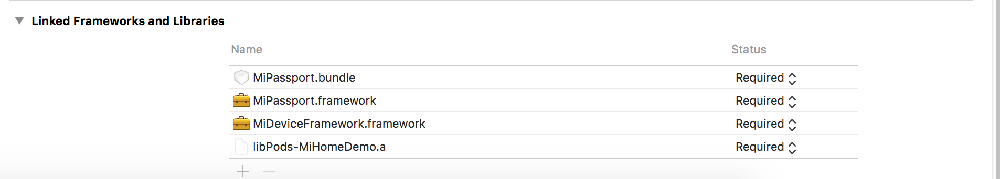
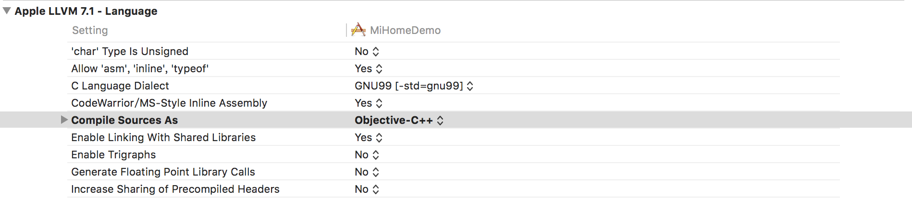

# SDK 入门指南
## SDK的文件构成

1. MiDeviceFramework: MiHome独立SDK的主体.封装了与设备快连,远程操作设备,拉取设备列表,帐号持久化等接口。

2. MiPassport: 小米官方给第三方开发者的基于OAuth2.0的账户登录SDK。

## SDK需要的条件

1. 注册

	在[小米开放平台](http://dev.xiaomi.com/)注册小米账户服务。 取得appid，以及redirectURL。

2. 开通权限

	在 “开放接口” 中 开启 “使用您的智能家庭服务“ 权限。并公司邮件发送appid给服务器组的同学才能拉取到。

# SDK 集成步骤

1. 本SDK统一使用CocoaPods管理。使用此SDK，请安装[CocoaPods](http://code4app.com/article/cocoapods-install-usage)。
本SDK需要关联的第三方库为：
```
pod 'AFNetworking','3.1.0'
pod 'YYModel'
```
2. 建立自己的工程，把两个framework（MiDeviceFramework，MiPassport）导入。


3. 改变工程的编译环境


4. 完成上述步骤就可以正式开发了。

# API 简介

1. 设备操作相关接口。

1.1 MHDevice.h

设备的基本信息。简单的理解为设备的基础数据结构

1.2 MHDevices.h

设备的一个集合。

1.3 MHDeviceManager.h

设备操作类。包含了拉取设备列表，获取新接入的设备，绑定设备，远程操作设备等接口。

1.3.1 获取设备列表

```objc
-(void)fetchDeviceListWithFilters:(NSArray<NSString*>*)dids
DeviceListBlock:(void(^)(MHDevices* deviceList))deviceList
failure:(void(^)(NSError* error))failure
```

param： dids，需要获取的设备属性的列表。如果想要获取指定设备的属性，
需要传入。如果默认拉取账户下所有的设备，只需要传入nil。

deviceListBlock：请求成功之后返回的设备列表。

failure：请求失败返回的信息。


1.3.2 获取快连新接入的设备
```objc
-(void)fetchNewDeviceWith:(NSString*)ssid
                withBssid:(NSString*)bssid
                DeviceListBlock:(void(^)(MHDevices* deviceList))deviceList
                failure:(void(^)(NSError* error))failure;
```
param： ssid，路由器的ssid

bssid，路由器的mac地址。设备需要跟路由器绑定。
有时需要返回整个局域网的设备。

devicelistBlock：同上。

failure：同上。


1.3.3 操作设备
```objc
-(void)callDeviceMethod:(MHDevice*) device
				method:(NSString *)method
				params:(id)params
				sucess:(void(^)(id result))sucess
				failure:(void(^)(NSError* error))failure;
```

param： device，需要操作的设备。
method，具体的操作方法。
params，操作需要传入的参数。
sucess，操作成功的回调。
failure，操作失败的回调。

1.4 MHDeviceSmartConfig.h 设备快连的类
```objc
-(void)startAPSmartConfigDeviceIp:(NSString*)deviceIp
						WithSSID:(NSString*)ssid
						WithBSSID:(NSString*)bssid
						password:(NSString*)password
						userId:(NSString*)userId
						domain:(NSString*)domain
						progressBlock:(void(^)(kSmartConfigState state,
						kSartConfigResult result,BOOL* stop))progressBlock;
```
param： deviceip，设备的ip地址。(demo中有获取设备ip的code)
ssid：  路由器的ssid。
bssid： 路由器的mac地址。（demo中有获取路由器mac地址的code）
password:路由器的密码。
userid：小米帐号的id。
domain：用户所在的区域。
progressBlock:每步快连后的回调，每一步快连后会通知快练当前的过程
以及成功的状态，以及是否进行下一步。
默认走完四步的话，整个快连就是一个完整的过程。

2. 帐号网络相关接口

2.1 MHAccount.h
在MiPassport的基础上再次封装了一层，包括数据的持久化。
具体接口见接口API。

2.2 MHRequestSerializer.h

2.2.1 @protocol MHRequestConfig <NSObject>
这个protocol的作用是，如果一些需要自定义的参数需要在网络请求的时候加入的，需要一个comform这个
protocol的实例。在这个里面你可以做任何事情，比如说把参数加密，或者在原有的参数的基础上增加某些
参数。

2.2.2 MHRequestBodySerializer
一个具体的实例。是把一些帐号信息加入到参数中

2.2.3 MHRequestCookieSerializer
一个具体的实例。把帐号信息设置成cookie。

2.3 MHNetworkEngine.h
SDK的网络请求。
```objc
+(void)callRemoteApi:(MHBaseRequest*)request
			httpMethod:(NSString*)method
			sucess:(void(^)(MHBaseRequest* request,id result))sucess
			failure:(void(^)(NSError* error))failure;
```
自己继承MHBaseRequest,写一个自己的网络请求。然后发给小米的后台。前提
是你自己知道自己该调用哪个接口。

param：request,自己重写的request。
method,现在只支持GET。
sucess，成功的返回。
failure，失败后的返回。

# API 使用
## App开发
App开发分四部分：
1. 初始化帐号系统
2. 快联设备
3. 获取设备列表
4. 操作设备

### 初始化帐号系统
SDK需要登陆后才能操作设备，所以APP开发必须申请API和取得appid，以及redirectURL。当申请得到appid和redirectUrl后，在AppDelegate的application:didFinishLaunchingWithOptions: 方法中初始化账户

```objc
- (BOOL)application:(UIApplication *)application didFinishLaunchingWithOptions:(NSDictionary *)launchOptions {
	_account = [[MHAccount alloc] initWithAppId:@"申请的appid" redirectUrl:@"http://xiaomi.com"];
    return YES;
}
```

### 登录
登录需要注册相关的通知事件，然后调用login 方法，权限为数组，更多的权限见[小米账户权限](https://dev.mi.com/docs/passport/scopes/)
```objc
//注册相关通知
[[NSNotificationCenter defaultCenter] addObserver:self selector:@selector(accountLogin:) name:MH_Account_Login_Sucess object:nil];

[[NSNotificationCenter defaultCenter] addObserver:self selector:@selector(accountLogout:) name:MH_Account_Logout_Sucess object:nil];

[[NSNotificationCenter defaultCenter] addObserver:self selector:@selector(accountLogCancel:) name:MH_Account_Login_Cancel object:nil];
    
[[NSNotificationCenter defaultCenter] addObserver:self selector:@selector(accountLoginFailure:) name:MH_Account_Login_Failure object:nil];

//登录
[_account login:@[@1,@3,@6000]];

```

### 获取账户信息
当登录成功后，可以调用fetchAccountProfile 方法获取登录账户的相关信息。MHAccountProfile
```objc
[_account fetchAccountProfile:^(MHAccountProfile *profile, NSError *error) {
    _profile = profile;
	NSLog(@"_profile.userId = %@",_profile.userId);
}];
```

### 快连设备（如果已经快连，此步略过）
快联有三种方式：
1. AP方式
2. bindkey绑定方式
3. combo 快联（见[蓝牙文档 3.4 combo快联章节](./MiHomeBluetoothAPI.md#34-combo快联)）

#### 1、AP方式快联
APP要控制设备，需要先进行快联设备，告诉设备wifi 和对应的密码。设备快联成功后就可以操作设备了。(具体代码可以见Demo 程序中的 MHScanViewController.m 文件)
```objc
- (void)authButtonClick:(id)sender{
	_smartConfig = [[MHDeviceSmartConfig alloc] init];
	[_smartConfig startAPSmartConfigDeviceIp:[self getRouterIp]
									WithSSID:@"Banana"
									WithBSSID:_bssid
									password:@"密码"
									userId:_profile.userId 
                                    domain:@"cn"
									progressBlock:^(kSmartConfigState state,
									kSartConfigResult result, BOOL *stop) {
		NSLog(@"state = %d,result = %d",state,result);
	}];
}
```
#### 2、bindkey绑定方式
如果设备已经链接网络了，但是没有和小米帐号绑定，就需要要用bindkey的方式来绑定米家账户。 这时需要获取bindkey字符串，然后通过bindWithBindKey 方法来链接，
```objc
-(void)init{
	_deviceManager = [MHDeviceManager new];
}


-(void)bind:(NSString*)bindKey{
	[_deviceManager bindWithBindKey:bindKey success:^(id obj){
        MHDeviceBindWithBindkeyResponse* rsp = (MHDeviceBindWithBindkeyResponse*)obj;
        if(rsp.ret == 0){
            printf("绑定成功\r\n");
        }else{
            printf("绑定失败 errcode == %ld",rsp.ret);
        }

		} failure:^(NSError* err){
        	printf("bindKey fail\r\n");
	}];
}

[self init];
NSString* bindKey = @"";//获取的bindkey，通常是扫描二维码的方式得到
[self bind:bindKey];

```

### 获取快联成功后的新设备
当快联成功后，想知道新添加的设备是那个。请使用fetchNewDeviceWith 来获得
```objc
self.deviceManager = [MHDeviceManager new];
    
[self.deviceManager fetchNewDeviceWith:@"wifi名" withBssid:@"wifi名" withDeviceMac:nil channel:nil DeviceListBlock:^(MHDevices *devices) {
        NSLog(@"新设备是 %@",devices);
    }  failure:^(NSError *error) {
        NSLog(@"%@",error);
}];
```

### 获取设备列表
快联成后，就可以拉取设备列表，得到对应的Device。
```objc
MHDeviceManager* manager = [MHDeviceManager new];
[manager fetchDeviceListWithFilters:nil DeviceListBlock:^(NSArray<MHDevice *> *devices) {
	NSLog(@"%@",devices);
} failure:^(NSError *error) {
	NSLog(@"%@",error);
}];
```


### 操作设备
获得设备之后，可以发对应的指令来操作，假设操作设备为一个插座，代码类似如下：

```objc
NSString* method = @"set_power";
id params = nil;
if (_isOn) {
	[self.oprationBtn setTitle:@"ON" forState:UIControlStateNormal];
	params = @[@"off"];
}else{
	[self.oprationBtn setTitle:@"OFF" forState:UIControlStateNormal];
	params = @[@"on"];
}
_isOn = !_isOn;
[_deviceManager callDeviceMethod:_device method:method params:params sucess:^(id result) {
	NSLog(@"%@",result);
} failure:^(NSError *error) {
	NSLog(@"%@",error);
}];
```
更多的操作见 MiOprationController.m

# Today Extension 开发
如果想开发iOS的today Extension。 设备访问的 API跟App 一样，但是widget没有登陆界面，所以watch和app共享账户信息。不然网络请求会发送失败

## 主app 登陆后，需要保存共享信息，代码类似如下（具体代码参见 ViewController.m 的 fecthDatas 方法）
```objc
- (void)setWidgetShareData{
	NSUserDefaults *shared = [[NSUserDefaults alloc] initWithSuiteName:@"group.mismarthome.1"];
	NSDictionary* dict = [MHPassport accountLoginParameters];
	[shared setObject:dict forKey:@"group.mismarthome.1.dict"];
	[shared synchronize];
}
```

## Today Extension 发送网络请求

首先自定义MHRequestSerializer 的子类。
```objc
@interface MHPGHPassportSerializer : MHRequestSerializer
@property (nonatomic, copy) NSString *locale;
@end

@implementation MHPGHPassportSerializer
-(NSDictionary*)configHttpRequest:(NSDictionary*)parameters{
	NSUserDefaults *shared = [[NSUserDefaults alloc] initWithSuiteName:@"group.mismarthome.1"];

	NSDictionary* dict = [shared objectForKey:@"group.mismarthome.1.dict"];
	NSMutableDictionary* mDict = [[NSMutableDictionary alloc] initWithCapacity:10];
	if(dict){
		[mDict addEntriesFromDictionary:dict];
	}
	if(parameters){
		[mDict addEntriesFromDictionary:parameters];
	}

	return mDict;
}
```
当today Extension 发送请求的时候，设置自定义的Serializer

```objc
_deviceManager = [MHDeviceManager new];
_deviceManager.serializer = [MHPGHPassportSerializer serializer];
[_deviceManager fetchDeviceListWithFilters:nil DeviceListBlock:^(MHDevices* deviceList) {
	_devices = [deviceList.devices copy];
	[self sendRPC];
} failure:^(NSError *error) {
	NSLog(@"%@",error);
}];
```


# 国际化
如果要做国际化的请求，需要自己设置调用MHBaseRequest的 setupBaseRequestUrl:的方法设置对应的请求服务器。

默认为中国的地址（https://openapp.io.mi.com/openapp），不需要设置

如果要请求美国的地址，徐需要在openapp前面加us。请求url变为
https://us.openapp.io.mi.com/openapp

```objc
[MHBaseRequest setupBaseRequestUrl:@"https://us.openapp.io.mi.com/openapp"]
```


